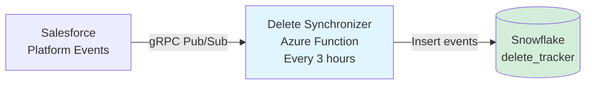

# Salesforce Delete Event Synchronizer

Real-time pipeline for tracking Salesforce delete events and syncing directly to Snowflake.

## System Overview

Single Azure Function that connects Salesforce to Snowflake:

```
Salesforce → Delete Synchronizer → Snowflake
              (every 3 hours)
```

**Schedule:** Every 3 hours  
**Purpose:** Fetch delete events from Salesforce and insert directly into Snowflake

- Authenticates to Salesforce via JWT
- Subscribes to platform events via gRPC Pub/Sub API
- Decodes Avro payloads
- Transforms events to Snowflake format
- Inserts directly into Snowflake `delete_tracker` table
- Maintains replay cursors for resumption
- **Uses RSA key authentication** for Snowflake (secure, production-ready)

## Quick Start

```bash
bash scripts/setup_venv.sh
cp local.settings.example.json local.settings.json
# Edit local.settings.json with Salesforce + Snowflake credentials
source .venv/bin/activate
func start
```

### Manual Trigger (Local Testing)

To run the function immediately without waiting for the 3-hour schedule:

```bash
# In another terminal (while func start is running)
curl -X POST http://localhost:7071/admin/functions/TimerPoller \
  -H 'Content-Type: application/json' \
  -d '{}'
```

Or using PowerShell:
```powershell
Invoke-RestMethod -Method Post -Uri http://localhost:7071/admin/functions/TimerPoller -ContentType 'application/json' -Body '{}'
```

## Architecture



## Data Flow

1. Timer trigger runs every 3 hours
2. Connects to Snowflake and reads replay cursors (resume positions)
3. Authenticates to Salesforce via JWT
4. Fetches delete events via Pub/Sub API (gRPC) from last cursor position
5. Decodes Avro payloads
6. Transforms events to Snowflake format
7. Inserts events into Snowflake `delete_tracker` table
8. Updates replay cursors in Snowflake `cursor_store` table for next run

## Storage Structure

### Snowflake Tables

**1. `delete_tracker` - Stores delete events**
```sql
CREATE TABLE delete_tracker (
    id INTEGER AUTOINCREMENT,
    object_name VARCHAR(255) NOT NULL,
    record_id VARCHAR(255),
    deleted_by VARCHAR(255),
    delete_tracked_at TIMESTAMP_NTZ DEFAULT CURRENT_TIMESTAMP(),
    status VARCHAR(255),
    PRIMARY KEY (id)
);
```

**2. `cursor_store` - Stores replay cursors for event resumption**
```sql
CREATE TABLE cursor_store (
    topic VARCHAR(255) PRIMARY KEY,
    replay_id BINARY,
    last_updated TIMESTAMP_NTZ DEFAULT CURRENT_TIMESTAMP()
);
```

**Purpose of cursor_store:**
- Tracks the last processed event position for each Salesforce topic
- Enables resumption from exact position after failures or restarts
- Prevents duplicate event processing
- Persists across Azure Function executions (unlike local file storage)
- Each topic maintains independent cursor position

## Configuration

### Required Settings
- **Salesforce credentials:** JWT, Connected App details
- **Salesforce topics:** Comma-separated list of delete event topics
- **Snowflake credentials:** RSA key authentication (secure, production-ready)
- **Snowflake target:** Database, schema, table configuration

### Authentication
- **Salesforce:** JWT bearer token flow
- **Snowflake:** RSA key pair (no password needed)

## Deployment

Deploy to Azure Functions:

```bash
az login

# Create resources (one-time)
az group create -n <rg> -l <region>
az storage account create -n <storageName> -g <rg> -l <region> --sku Standard_LRS
az functionapp create -g <rg> -n <appName> -s <storageName> \
  --consumption-plan-location <region> --runtime python --functions-version 4

# Deploy
func azure functionapp publish <appName> --python

# Configure settings
az functionapp config appsettings set -g <rg> -n <appName> --settings \
  SF_CLIENT_ID='<id>' \
  SF_USERNAME='<email>' \
  SF_LOGIN_URL='https://login.salesforce.com' \
  SF_PRIVATE_KEY_PATH='certs/private.key' \
  SF_TOPIC_NAMES='/event/Account_Delete__e,/event/Contact_Delete__e' \
  SNOWFLAKE_ACCOUNT='<account>.snowflakecomputing.com' \
  SNOWFLAKE_USER='<user>' \
  SNOWFLAKE_PRIVATE_KEY_PATH='certs/rsa_key.p8' \
  SNOWFLAKE_WAREHOUSE='COMPUTE_WH' \
  SNOWFLAKE_DATABASE='<database>' \
  SNOWFLAKE_SCHEMA='PUBLIC' \
  SNOWFLAKE_TABLE='delete_tracker'
```

### Snowflake RSA Key Setup

```bash
# 1. Generate key pair
openssl genrsa 2048 | openssl pkcs8 -topk8 -inform PEM -out rsa_key.p8 -nocrypt
openssl rsa -in rsa_key.p8 -pubout -out rsa_key.pub

# 2. Assign public key to Snowflake user
# In Snowflake SQL:
# ALTER USER your_user SET RSA_PUBLIC_KEY='MIIBIjANBg...';

# 3. Place private key in certs/ directory
mv rsa_key.p8 certs/
chmod 600 certs/rsa_key.p8
```

## Testing

### Local Testing with Mock Mode
1. Set `MOCK_MODE=true` in `local.settings.json`
2. Place mock event JSON files in `mock_data/` directory
3. Run function locally: `func start`
4. Trigger manually (see [Manual Trigger](#manual-trigger-local-testing) section) or wait for the 3-hour timer
5. Check Snowflake for inserted events

### Local Testing with Real Salesforce
1. Configure Salesforce credentials in `local.settings.json`
2. Set `MOCK_MODE=false`
3. Run function locally: `func start`
4. Trigger manually to test immediately
5. Monitor logs for event fetching and Snowflake insertion

### Production Monitoring

**Check recent events:**
```sql
SELECT * FROM delete_tracker 
ORDER BY delete_tracked_at DESC 
LIMIT 10;
```

**Count by object type:**
```sql
SELECT object_name, COUNT(*) 
FROM delete_tracker 
GROUP BY object_name;
```

**Events by day:**
```sql
SELECT DATE(delete_tracked_at) as date, COUNT(*) 
FROM delete_tracker 
GROUP BY DATE(delete_tracked_at)
ORDER BY date DESC;
```

**Check cursor positions (replay tracking):**
```sql
-- View all topic cursors and when they were last updated
SELECT 
    topic,
    TO_VARCHAR(replay_id) as replay_id_hex,
    last_updated,
    DATEDIFF('hour', last_updated, CURRENT_TIMESTAMP()) as hours_since_update
FROM cursor_store
ORDER BY last_updated DESC;

-- Find topics that haven't been updated recently (potential issues)
SELECT topic, last_updated
FROM cursor_store
WHERE last_updated < DATEADD('hour', -4, CURRENT_TIMESTAMP());
```

**Check Snowflake connection history (RSA key auth):**
```sql
SELECT * FROM SNOWFLAKE.ACCOUNT_USAGE.LOGIN_HISTORY
WHERE USER_NAME = '<your_user>'
  AND AUTHENTICATOR = 'RSA_KEYPAIR'
ORDER BY EVENT_TIMESTAMP DESC
LIMIT 10;
```

## Key Features

- **Real-time sync:** Events inserted within 3 hours of deletion
- **Replay capability:** Never miss events with cursor-based resumption stored in Snowflake
- **No duplicate processing:** Cursors ensure each event is processed exactly once
- **Persistent cursors:** Stored in Snowflake, survive Azure Function restarts/scaling
- **Secure authentication:** RSA key auth for both Salesforce (JWT) and Snowflake
- **Error resilience:** Graceful handling of API failures with automatic resumption
- **Local development:** Mock mode for testing without Salesforce
- **Scalable:** Add topics without code changes
- **Simple architecture:** Single function, single database, no intermediate storage
- **Production-ready:** No password storage, secure key-based auth

## Technology Stack

- Azure Functions (Python 3.9+)
- Salesforce gRPC Pub/Sub API
- Avro serialization (fastavro)
- Snowflake data warehouse
- JWT authentication (Salesforce)
- RSA key authentication (Snowflake)
- Protocol Buffers (gRPC)

## Repository Structure

```
delete_synchronizer/
├── TimerPoller/           # Azure Function (timer trigger)
│   ├── __init__.py        # Main orchestration logic
│   └── function.json      # Function configuration
├── src/
│   ├── config/            # Settings and configuration
│   ├── salesforce/        # Salesforce auth and Pub/Sub client
│   │   ├── auth.py
│   │   ├── pubsub_client.py
│   │   └── proto/         # Generated protobuf files
│   ├── snowflake/         # Snowflake connector
│   │   └── connector.py
│   ├── replay/            # Cursor store for replay IDs
│   │   └── cursor_store.py
│   ├── utils/             # Transformation utilities
│   │   └── transform.py
│   ├── schemas/           # Data schemas
│   └── mock_events.py     # Mock data loader
├── certs/                 # Private keys (not in git)
├── mock_data/             # Mock event JSON files
├── tests/                 # Unit tests
├── scripts/               # Setup scripts
├── requirements.txt
├── host.json
├── local.settings.example.json
└── README.md
```

## Security Best Practices

✅ **Recommended:**
- Use RSA key authentication for Snowflake (no passwords)
- Store private keys in Azure Key Vault for production
- Use service accounts (not personal users)
- Rotate keys regularly (every 90 days)
- Separate keys per environment (dev/staging/prod)
- Use JWT authentication for Salesforce
- Keep `.gitignore` up to date (exclude `certs/`, `*.p8`, `*.key`)

❌ **Avoid:**
- Committing private keys to git
- Sharing keys between services or environments
- Using personal user accounts for automation
- Storing passwords in plain text
