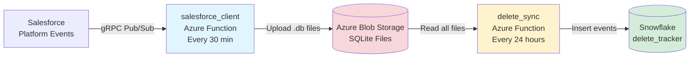

# Salesforce Delete Event Tracker

Complete pipeline for tracking Salesforce delete events and syncing to Snowflake.

## System Overview

Two separate Azure Function apps that work together:

```
Salesforce → salesforce_client → Azure Blob Storage → delete_sync → Snowflake
```

### 1. salesforce_client (Event Collector)
**Schedule:** Every 30 minutes  
**Purpose:** Fetch delete events from Salesforce and store in SQLite files

- Authenticates to Salesforce via JWT
- Subscribes to platform events via gRPC Pub/Sub API
- Decodes Avro payloads
- Stores events in timestamped SQLite files
- Uploads to Azure Blob Storage
- Maintains replay cursors for resumption

[→ Full documentation](./salesforce_client/README.md)

### 2. delete_sync (Snowflake Sync)
**Schedule:** Every 24 hours  
**Purpose:** Sync all SQLite files to Snowflake for analytics

- Lists all event files from Azure Blob Storage
- Downloads and reads SQLite databases
- Inserts events into Snowflake `delete_tracker` table
- Skips duplicates automatically

[→ Full documentation](./delete_sync/README.md)

## Quick Start

### Setup salesforce_client
```bash
cd salesforce_client
bash scripts/setup_venv.sh
cp local.settings.example.json local.settings.json
# Edit local.settings.json with Salesforce credentials
source .venv/bin/activate
func start
```

### Setup delete_sync
```bash
cd delete_sync
bash scripts/setup_venv.sh
cp local.settings.example.json local.settings.json
# Edit local.settings.json with Snowflake credentials
source .venv/bin/activate
func start
```

## Architecture



## Data Flow

1. **salesforce_client** polls Salesforce every 30 minutes
2. Fetches delete events via Pub/Sub API
3. Stores in `events_YYYYMMDDTHHMMSSZ.db` files
4. Uploads to Azure Blob Storage `events/` container
5. **delete_sync** runs once per day
6. Downloads all SQLite files from blob storage
7. Inserts events into Snowflake (skips duplicates)

## Storage Structure

### Azure Blob Storage
```
events/
├── events_20251021T103000Z.db
├── events_20251021T133000Z.db
├── events_20251021T163000Z.db
└── ...
```

### Snowflake Table
```sql
CREATE TABLE delete_tracker (
    id INTEGER PRIMARY KEY,
    event_id VARCHAR(255) UNIQUE,
    topic VARCHAR(255),
    object_name VARCHAR(255),
    record_id VARCHAR(255),
    deleted_by VARCHAR(255),
    deleted_date TIMESTAMP_NTZ,
    owner_id VARCHAR(255),
    payload VARIANT,
    ingested_at TIMESTAMP_NTZ
);
```

## Configuration

### salesforce_client
- Salesforce credentials (JWT, Connected App)
- Azure Blob Storage connection
- Platform event topic names

### delete_sync
- Azure Blob Storage connection (same as above)
- Snowflake credentials
- Target table configuration

## Deployment

Both apps deploy independently to Azure:

```bash
# Deploy salesforce_client
cd salesforce_client
func azure functionapp publish <salesforce-app-name> --python

# Deploy delete_sync
cd delete_sync
func azure functionapp publish <snowflake-sync-app-name> --python
```

## Testing

### Local Testing
1. Set `MOCK_MODE=true` in salesforce_client
2. Run salesforce_client to generate test SQLite files
3. Run delete_sync to sync to Snowflake
4. Query Snowflake to verify

### Production Monitoring
```sql
-- Check recent events
SELECT * FROM delete_tracker 
ORDER BY ingested_at DESC 
LIMIT 10;

-- Count by object type
SELECT object_name, COUNT(*) 
FROM delete_tracker 
GROUP BY object_name;

-- Events by day
SELECT DATE(ingested_at) as date, COUNT(*) 
FROM delete_tracker 
GROUP BY DATE(ingested_at)
ORDER BY date DESC;
```

## Key Features

- **Replay capability:** Never miss events with cursor-based resumption
- **Duplicate prevention:** Events inserted once via `event_id` uniqueness
- **Error resilience:** Both functions handle failures gracefully
- **Local development:** Mock mode for testing without Salesforce
- **Scalable:** Add topics or increase frequency without code changes
- **Auditable:** Full event history in Snowflake for analytics

## Technology Stack

- Azure Functions (Python 3.9+)
- Salesforce gRPC Pub/Sub API
- Avro serialization
- SQLite for intermediate storage
- Azure Blob Storage
- Snowflake data warehouse
- JWT authentication

## Repository Structure

```
sf_delete_tracker/
├── salesforce_client/       # Event collector from Salesforce
│   ├── TimerPoller/         # Azure Function
│   ├── src/app/            # Application code
│   ├── requirements.txt
│   └── README.md
├── delete_sync/            # Snowflake sync
│   ├── SnowflakePusher/   # Azure Function
│   ├── src/                # Application code
│   ├── requirements.txt
│   └── README.md
└── README.md              # This file
```

